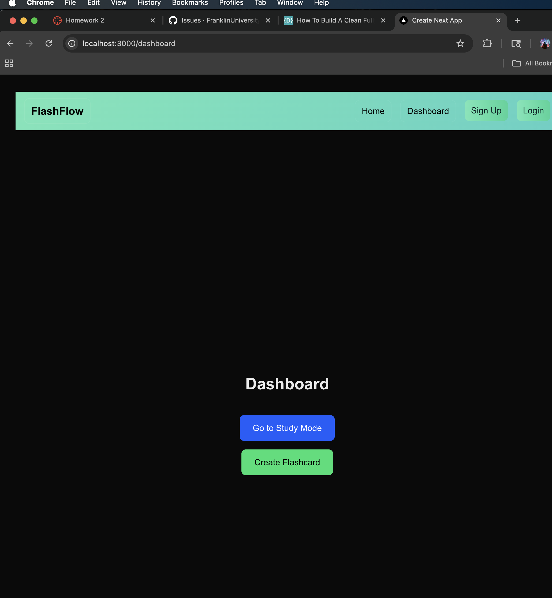
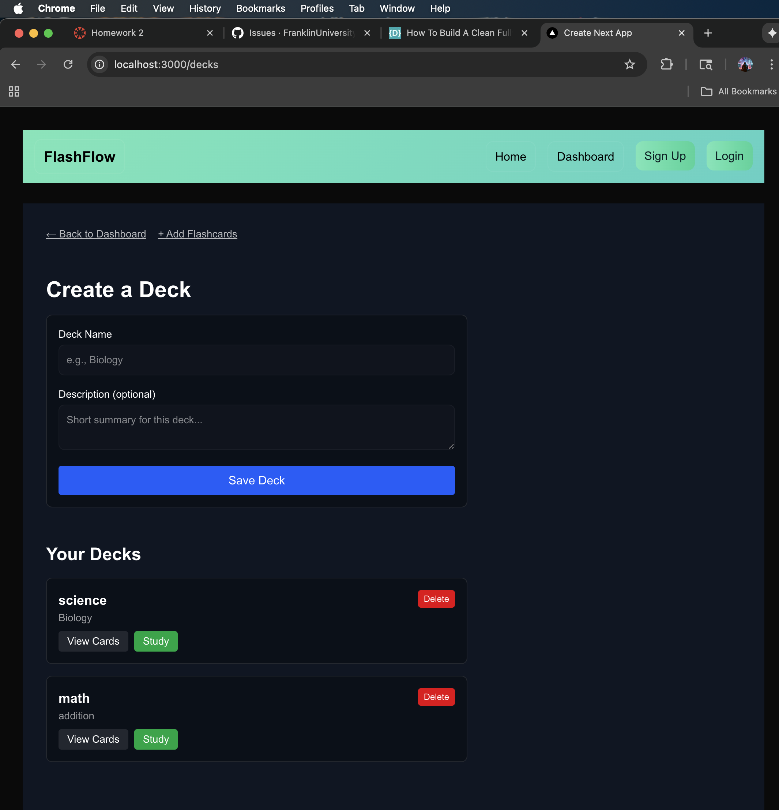
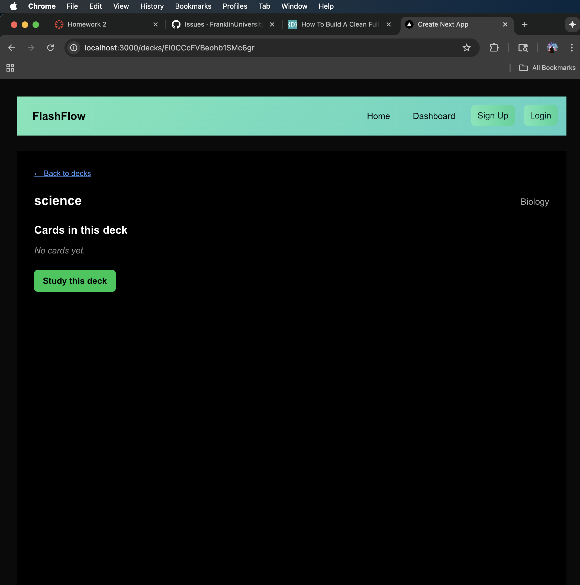
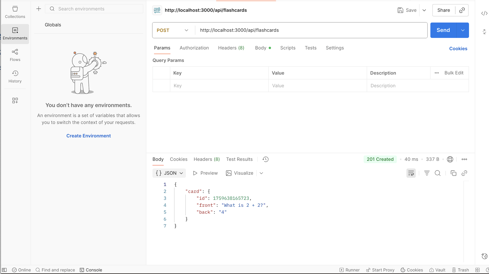
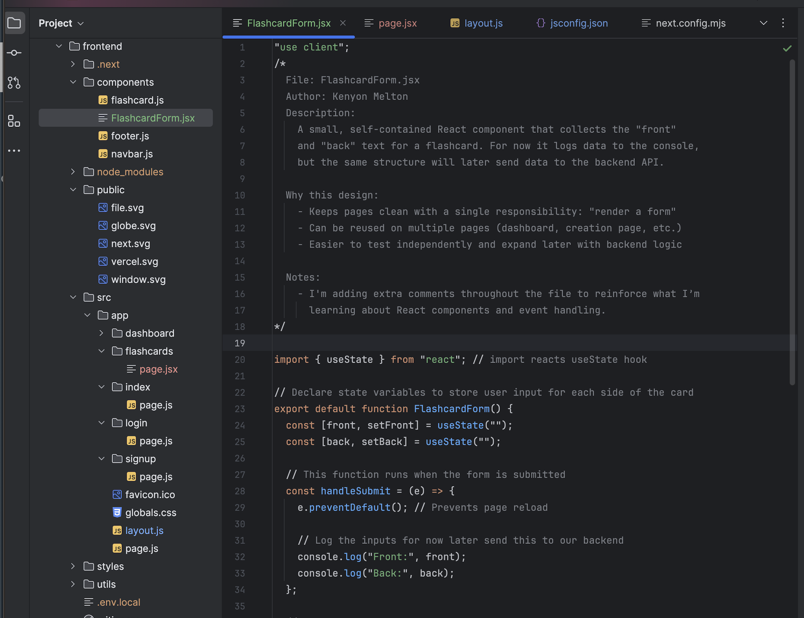
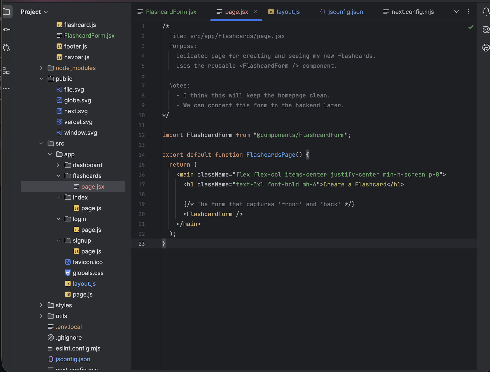
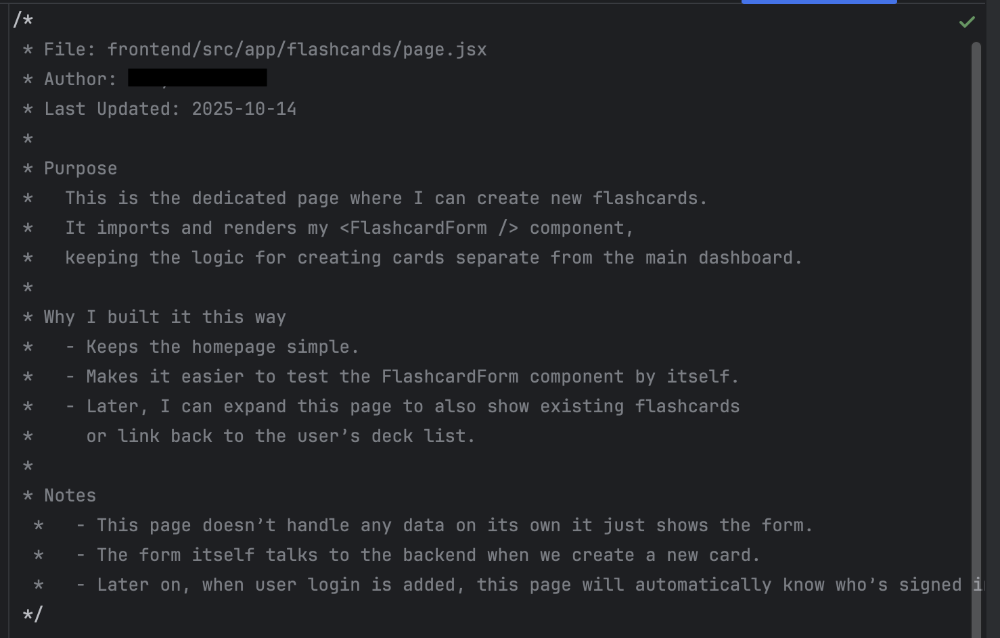

# FlashFlow

## About This Repository

This repository is a public showcase documenting FlashFlow, a collaborative study platform developed as part of a team based academic project created at University.

The original source repository remains private and is not included here out of respect for team collaboration, repository privacy, and responsible software development practices.

This showcase repository is intended to document:
- Project architecture
- Technologies used
- Development workflow
- Feature design
- My technical contributions
- Lessons learned throughout development

No private source code, credentials, proprietary assets, or teammate-owned implementation details are included in this repository.

---

## Project Overview

FlashFlow is a collaborative study platform designed to help students create, organize, and manage digital flashcards in a team-oriented learning environment.

The platform was built to support:
- Collaborative studying
- Flashcard management
- User authentication
- Shared study workflows
- Interactive frontend experiences
- Cloud-based persistence and storage

---

## Key Features

- Collaborative flashcard creation and organization
- User authentication and protected routes
- Interactive frontend study workflows
- Backend API architecture and routing
- Persistent cloud storage using Firebase
- Team-based development workflow
- Structured frontend and backend separation

---

## My Contributions

My primary contributions focused on the flashcard subsystem across both frontend and backend development.

Areas I contributed to included:
- Flashcard feature architecture
- Frontend UI and workflow implementation
- Backend controller and routing logic
- Authentication-related functionality
- API integration and application flow
- Repository organization and development workflow
- Testing and debugging support
- Technical planning and collaboration

I was heavily involved in designing and implementing the flashcard functionality across the application stack while working within a collaborative team environment.

---

## Technology Stack

### Frontend
- React
- Next.js
- HTML5 / CSS3
- JavaScript

### Backend
- Node.js
- Express.js

### Database & Cloud Services
- Firebase Firestore
- Firebase Authentication
- Firebase Hosting

### Development Tools
- Git & GitHub
- npm
- Visual Studio Code
- Jest

---

## Repository Structure

```text
docs/      -> architecture notes and supporting documentation
images/    -> screenshots and visual assets
README.md  -> project showcase documentation
```

---

# Project Screenshots

## Dashboard



---

## Deck Creation Workflow



---

## Deck View



---

## API Testing and Backend Integration



---

## Reusable React Component Architecture



---

## Frontend Page Architecture



---

## Development Notes and Component Planning


## Architecture Overview

FlashFlow followed a structured frontend/backend architecture with separate responsibilities for UI rendering, API handling, authentication, and cloud persistence.

Additional architecture documentation can be found in:

```text
docs/architecture-overview.md
```

---

## Lessons Learned

This project strengthened skills in:
- Full-stack application development
- Frontend/backend integration
- Authentication workflows
- Team-based Git collaboration
- API architecture
- Cloud-connected applications
- Technical planning and documentation

---

## Disclaimer

This repository exists strictly as a professional portfolio showcase.

The original collaborative source repository remains private. No private implementation files, secrets, credentials, or teammate-owned source code are included here.
